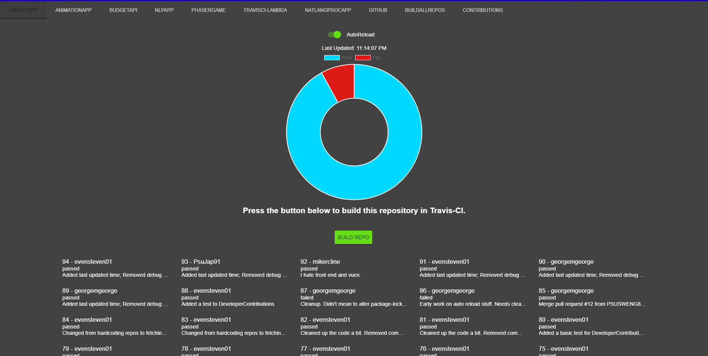
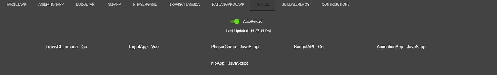

# Material Design Spike

## Preliminary Information

We use a library call [VueMaterial](https://vuematerial.io/components) that give our components the visual aspect of material design. However, the application does not provide the best user experience. Provided is a [sandbox](https://codesandbox.io/s/pwmv5o754m) environment, to help better understand the [material guidelines](https://material.io/design/) and play around with some throw away code some of which was prebuilt. The focus of which centers on navigation, and data display. Our application does not take full advantage of the navigation and routing capabilities. While feeling disjointed and unfocused due to information overload and feature splitting.

## Current Construction

As currently constructed, our application has a login screen:

and an App screen:

Furthermore there are several tabs with information about each repository, this information is not available under the respective repository tab.For example the GitHub tab has information about user Check-Ins for each Repository see example below, while functional this requires a bit more cognitive reasoning than many user's would expect.

### Example

All the information about the a repository should be in the repository section.

## Recommendations

With such a dense amount of information, much of which is unrelated or not necessary to view at the same time, it is recommended to tabulate or otherwise group this information in smaller consumable bites. Nesting tabs is not a recommended practice, the recommendation would be to `navigate` to each repository. As shown in the sandbox this can be done with a navigation menu while the sandbox does not use vue-router this would be used for our application.

### High-Level Tasks

- Add Application Header Bar
- Add a *Landing* Page, with some information about the application or instructions etc.
- Create Navigation Component
  - Dynamically Generate Navigation List Items
  - May contain some static list items
- Create Navigation Routes
  - Repository navigates by Id
  - Static routes if necessary i.e. Utilities (Build All Repositories)
- Refactor/Add Repository Component with Grouped information
